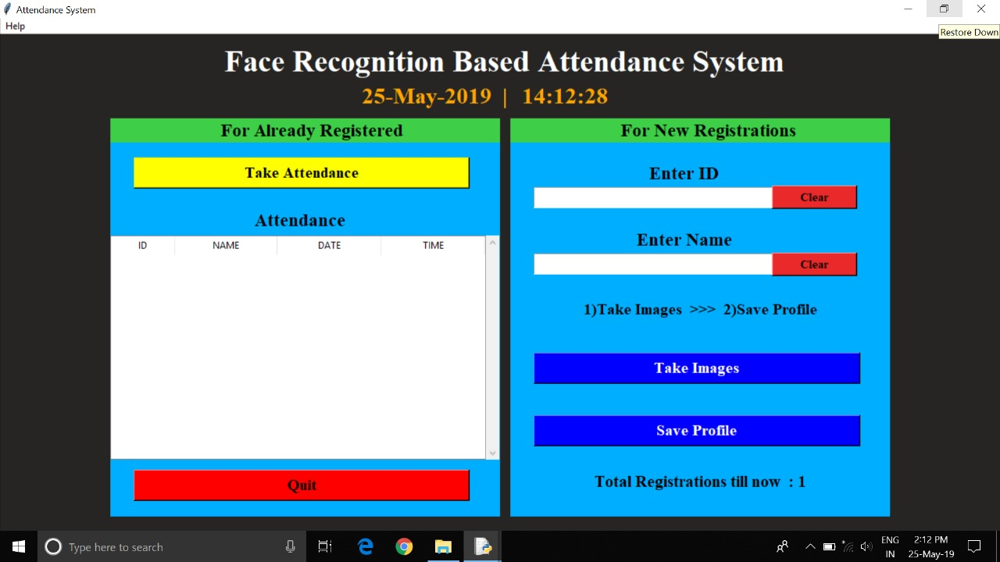

# Face_Recognition Project


---

## Table of Contents
- [Project Overview](#project-overview)
- [Motivation](#motivation)
- [Key Features](#key-features)
- [Technology Used](#technology-used)
- [User Interface](#user-interface)
- [User Guide](#user-guide)
  - [Face Training](#face-training)
  - [Face Recognition](#face-recognition)
  - [View Attendance](#view-attendance)
- [Database Setup](#database-setup)
- [Tips](#tips)
- [Known Limitations](#known-limitations)
- [License](#license)

---

## Project Overview

**Face_Recognition** is a Java-based facial recognition system designed to **automate attendance tracking**. It leverages **OpenCV via JavaCV** for real-time face detection and recognition and logs attendance in a structured format. This project demonstrates practical applications of computer vision and machine learning in real-world scenarios.

---

## Motivation

This project aims to provide a **simple and effective facial recognition system** that can run locally. Typical use cases include:

- Access control / authentication  
- Attendance tracking for classrooms or offices  
- Organizing personal media based on faces  
- Learning and experimenting with face detection & recognition  

---

## Key Features

- Auto attendance system using **real-time face recognition**  
- Face trainer for capturing multiple images per person  
- Face recognition using **LBPH algorithm**  
- Rectangle shape detection around faces  
- Trained faces image gallery view  
- Database integration for persistent storage  
- Logs attendance with timestamps  

---

## Technology Used

- Core Java  
- OpenCV (via JavaCV)  
- MySQL  
- Maven  
- Haar Cascade Classifier  

---

## User Interface



---

## User Guide

### 1. Face Training
- Click **Train Faces** in the application.  
- Capture multiple images from the webcam (ideally 10+ images from different angles).  
- Images are stored in `resources/trained_faces/` and saved in the database.  

### 2. Face Recognition
- Click **Start Recognition**.  
- Webcam detects faces in real-time.  
- Recognized faces are logged in attendance with timestamps.  

### 3. View Attendance
- Retrieve attendance records from the database or GUI.  

---
## TIPS

- Capture 10+ images per person from different angles for best accuracy.

- Clear the faces folder after training to remove test images.

- Make sure database is correctly configured before running recognition.

## Limitations

- Faces not trained or unknown may produce incorrect recognition results.

- Algorithm guesses the nearest match if no exact match is found.

- Low-light, occlusions, or extreme angles reduce accuracy
  
## Database Setup

1. Open MySQL on XAMPP and create a new database named **ghostEye**.  
2. Import the provided `face_bio.sql` into the **ghostEye** database, or manually create the table:

```sql
CREATE TABLE IF NOT EXISTS `face_bio` (
  `id` int(11) NOT NULL,
  `code` int(10) NOT NULL,
  `first_name` varchar(30) NOT NULL,
  `last_name` varchar(20) NOT NULL,
  `reg` int(10) NOT NULL,
  `age` int(10) NOT NULL,
  `section` varchar(20) NOT NULL
) ENGINE=InnoDB AUTO_INCREMENT=1 DEFAULT CHARSET=latin1;

ALTER TABLE `face_bio`
ADD PRIMARY KEY (`id`);

ALTER TABLE `face_bio`
MODIFY `id` int(11) NOT NULL AUTO_INCREMENT,AUTO_INCREMENT=1;...```

---


       

 

