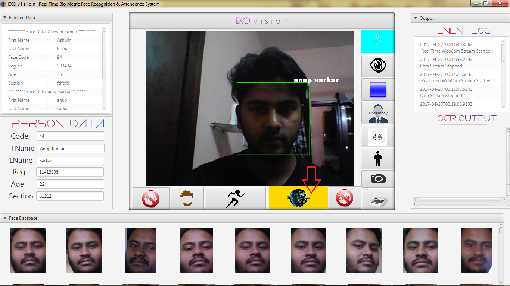

## PROJECT OVERVIEW

Face_Recognition is a Java-based facial recognition system that automates attendance tracking. It uses OpenCV for real-time face detection and recognition and logs attendance in a structured format. This project demonstrates practical application of computer vision and machine learning concepts in a real-world scenario.


## KEY FEATURES
* Auto Attendance system Using Real Time Face Recognition
* Face Trainer
* Face recognition using LBPH algorithm
* Rectangle Shape Detection
* Trained Faces Image Gallery View
* Database integration
* Persistent Storage for Trained Faces Image Using Database

## TECHNOLOGY USED
* Core Java
* opencv(via javaCV)
* MySQL
* Maven
* Haar Cascade Classifier
## USER INTERFACE



## USER GUIDE

 1.FACE TRAINING
* Click Train Faces.
* Capture multiple images from webcam.
* Images are stored in resources/trained_faces/ and saved in database.

 2.FACE RECOGNITION
* Click Start Recognition.
* Webcam detects faces in real-time.
* Recognized faces are logged in attendance with timestamp.

 3.VIEW ATTENDENCE
* Attendance records can be retrieved from database or GUI.
   


## Database Settings 
* Open MySQL on XAMPP then Create a New Database & name it **ghostEye** 
* Now import attached **face_bio.sql** to the  **ghostEye** Database
* Or Create a New Schema(Table)
```sql

CREATE TABLE IF NOT EXISTS `face_bio` (
`id` int(11) NOT NULL,
  `code` int(10) NOT NULL,
  `first_name` varchar(30) NOT NULL,
  `last_name` varchar(20) NOT NULL,
  `reg` int(10) NOT NULL,
  `age` int(10) NOT NULL,
  `section` varchar(20) NOT NULL
) ENGINE=InnoDB AUTO_INCREMENT=1 DEFAULT CHARSET=latin1;


ALTER TABLE `face_bio`
 ADD PRIMARY KEY (`id`);
 
 ALTER TABLE `face_bio`
MODIFY `id` int(11) NOT NULL AUTO_INCREMENT,AUTO_INCREMENT=1;

```

* Now Open src/application/Database.java and provide your MySQL DB credintials
```java
package application;

import java.sql.*;
import java.util.ArrayList;
import java.util.List;

class Database {
	public int code;

	public String fname;
	public String Lname;
	public int reg;
	public int age;
	public String sec;

	public final String Database_name = "Your Database";
	public final String Database_user = "Your Database user Name";
	public final String Database_pass = "Your Database Password";

	.
	.
	.
```


# Tips
* When you going to train a new face try to capture at least 10 pictures of a single person in different angle.keep it in mind that the more number of training image in different angle and posture, the more accurate will be  face recognition.
* After everything done ,kindly empty the **faces** folder.There is a test_face image.You have to delete it.

# Please Note:
Please Keep it in mind ,sometimes the face recognition algorithm provides wrong output if a person is not trained or unknown to the system.The reason behind this is that the face recognition algorithm guess the face with the nearest match.when it does not find any match ,the system pick any face with a nearest match.this is  why it sometimes provides wrong output.


       

 

